# 架构与设计（项目细节）

> 本文档整合 JuanNiang-Neo 的架构、调用栈、EventLoop 与插件系统，作为二次开发与运维理解的核心参考。

本文档整合 JuanNiang-Neo 的架构、调用栈、EventLoop 与插件系统，作为二次开发与运维理解的核心参考。

## 一、架构

## 概述

JuanNiang-Neo 是基于 OneBot11 协议的 LLM QQ 聊天 Agent 系统（红岩网校吉祥物"卷娘"）。核心由 LLM 驱动的对话 Agent（`HagoCenter`，聚合 Provider / MCP / Memory / Prompt / Session / Skill / Tool）与 OneBot11 反向 WebSocket 适配器组成，基于 Eino ADK 框架构建 `ChatModelAgent`，工具调用在 ReAct 循环内同步执行。事件流经五阶段管线：幂等去重 → 系统级群管理检测 → Plugin 拦截 → 消息过滤 → 回复策略检查 → 异步派发 Agent，每个聊天区域由 `ConcurrencyManager` 控制最多 8 个 Agent goroutine 并发。项目还包含 Lua 插件引擎、Vue 3 管理面板，以及 Postgres + Redis + Sandbox + T2I + RAG 等可插拔基础设施。所有持久化状态落 Postgres + Redis，配置与运行时状态均可在 Web 面板热切换。

## 分层架构

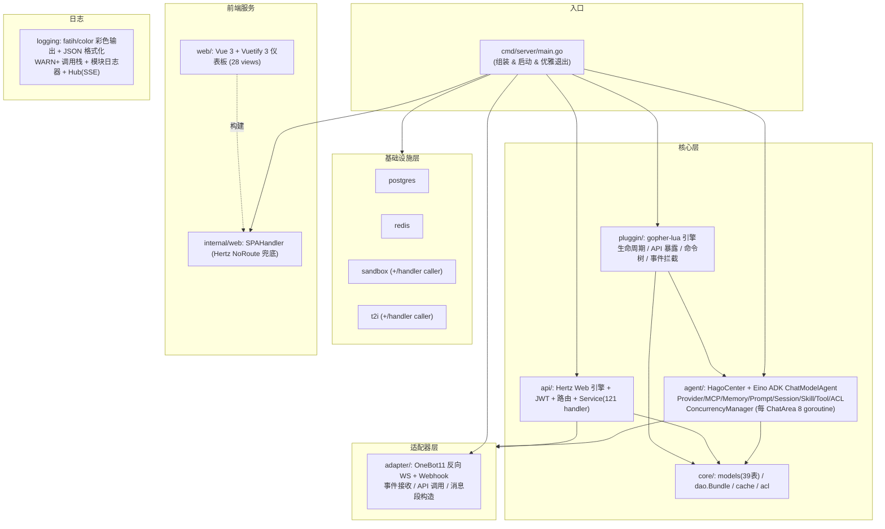

## 模块职责

| 模块 | 包路径 | 职责 |
|------|--------|------|
| **入口** | `cmd/server/main.go` | 组装所有模块、启动服务、反向优雅退出（带 15s watchdog） |
| **适配器** | `internal/adapter/` | OneBot11 反向 WS 服务端 + Webhook HTTP 服务端：事件解析、API 封装、消息段构造 |
| **Agent** | `internal/agent/` | Agent 核心：`HagoCenter` 聚合 Provider/MCP/Memory/Prompt/Session/Skill/Tool/ACL + Eino ADK ChatModelAgent (ReAct loop) + ConcurrencyManager (每 ChatArea 8 goroutine)，事件循环、CronJob、回复策略 |
| **核心库** | `internal/core/` | 数据模型 (GORM)、DAO Bundle、Redis 缓存、ACL |
| **Web API** | `internal/api/` | Hertz Web 引擎、JWT 中间件、路由、Service（121 个 handler + 根路径 `/health`） |
| **插件** | `internal/pluggin/` | gopher-lua 引擎：生命周期、Lua API 暴露、命令树、事件拦截 |
| **基础设施** | `infrastructure/` | postgres、redis、sandbox、t2i 客户端（每个含 `handler` 子包，功能选项风格） |
| **前端服务** | `internal/web/` | `SPAHandler` 通过 Hertz `NoRoute` 兜底服务 `web/dist` |
| **日志** | `internal/logging/` | fatih/color 彩色输出 + JSON 格式化 + 调用栈 + Hub(SSE) |

> **术语陷阱**：`internal/adapter.Provider`=OneBot11 反向 WS 适配器；`internal/agent/provider.ProviderGroup`=LLM Provider 组。`pluggin` 是有意拼写（Lua 插件系统），不要改成 `plugin`。`docs/guidance.md` 拼成 `inferstructure` 是错的，真实路径是 `infrastructure/`。

## 数据模型

共 39 个 GORM 表（见 `internal/core/core.go::AutoMigrate`）。

```mermaid
classDiagram
  class AdminUser { +uint ID; string Username; string PasswordHash; string Role }
  class Provider { string ID; ModelType Type; string Endpoint; string Token; string Model; float32 Temperature; bool IsActive }
  class MCPServer { string ID; string ServerURL; JSONMap Headers; int Timeout; JSONSlice ToolFilter; bool IsActive }
  class Skill { string ID; JSONSlice Keywords; string RegexPattern; string PromptRef; JSONSlice ToolRefs; JSONSlice McpRefs; int Priority }
  class ToolConfig { string ID; string Name; JSONMap Parameters; bool IsBuiltin; bool IsActive; bool AdminOnly }
  class Prompt { string ID; PromptType Type; string Content; bool IsSystem; bool IsActive }
  class Onebot11Adapter { uint ID; string Addr; int Port; string Token; JSONSlice AdminQQNumbers; bool Enabled }
  class WebhookConfig { uint ID; string Addr; int Port; string Token; bool Enabled }
  class T2IConfig { uint ID; string BaseURL; int Timeout; bool IsActive }
  class SandboxConfig { uint ID; string BaseURL; string APIKey; int Timeout; bool IsActive }
  class ChatArea { string ID; AreaType AreaType; int64 TargetID }
  class Session { string ID; string Model; int64 TokenUsage; JSONMap MetaData }
  class ShortTermMemory { string ID; int WindowSize; bool AutoCompact }
  class LongTermMemory { string ID; int HotAreaSize; int HotMemoryTTL }
  class LongTermMemoryItem { string ID; string Content; []byte Embedding; JSONMap Metadata }
  class ChatRecord { int64 ID; int64 UserID; string Role; string Content; int TokenCount; JSONMap ToolCalls }
  class ACLRule { int64 ID; ACLScope Scope; ACLPermission Permission; ACLTargetType TargetType; JSONSlice UserIDs }
  class CronJob { string ID; string CronExpr; string Message; string MessageType; int64 TargetID; bool IsActive; time Time LastRunAt }
  class ReplyStrategyConfig { string ID; ReplyStrategy Strategy; float64 RelevanceThreshold; string BotName; bool StripMarkdown; bool AgentLite; string RelevancePrompt; string RelevanceModel; string JudgeFailPolicy }
  class Plugin { string ID; string Name; string Version; string Path; JSONMap Config; bool IsActive }
  class SkillMemory { string ID; string Content }
  class KnowledgeItem { string ID; string Title; string Content; JSONSlice Keywords; string KeywordStatus }

  ChatArea "1" --|> "1" Session
  ChatArea "1" --|> "1" ShortTermMemory
  ChatArea "1" --|> "1" LongTermMemory
  LongTermMemory "1" --|> "N" LongTermMemoryItem
  ChatArea "1" --|> "N" ChatRecord
  ChatArea "1" --|> "N" ACLRule : "按 scope 分组"
```

### 关键模型语义

- **`ChatArea`**：私聊/群聊最小隔离单元，是 Session / Memory / ChatRecord / ACLRule 的父级。由首条消息自动 `GetOrCreate` 创建，无手动创建接口。
- **`ChatRecord`**：`id` 为自增 int64（其他模型多为 UUID）。`Session.AppendRecord` 写 Postgres 与短期记忆 Redis 写入**解耦**——前者为审计/检索，后者为 Agent 上下文窗口。
- **单行配置**：`Onebot11Adapter`/`WebhookConfig`/`T2IConfig`/`SandboxConfig` 固定 `id=1`，首次访问 DB 不存在时 `InitConfig` 用 `OnConflict DoNothing` 创建默认行。
- **`ReplyStrategyConfig`**：无 `DeletedAt` 的单例，策略已收敛为仅 `relevance`（默认 `strategy=relevance, relevance_threshold=0.5, judge_fail_policy=drop`）。
- **Prompt `IsSystem`**：启动时 `EnsureSystemPrompt` 幂等播种 `__system_locked__`，强制拼接（顺序 SystemLocked → system → personality → custom）。
- **Plugin `Manifest.System`**：系统插件三层守卫（Manifest.System + `PluginEngine.IsSystem()` + Service 层 Toggle/Delete）禁删/禁停。
- **`CronJob`**：不与 ChatArea 建外键；触发时由 `cronjob.Manager` 构造合成 `adapter.Event{PostType:"cronjob", IsCronJob:true}` 经 `CronJobEvents` channel 注入事件循环。
- **`SkillMemory`**：全局技能记忆单例（`id="global"`），存储从对话中提取的技能/知识/黑话。Compact 时由 LLM 自动更新，写回 Postgres。
- **`KnowledgeItem`**：SQL 知识库条目，存入时由 Agent 异步提取 `Keywords`（`keyword_status`: pending→ready/failed）；对话前 `buildKnowledgeContext` **首选 RAG 语义检索**（命中按分数注入 ≤5 条），未配置/失败/无命中降级为关键词命中 + 内容 ILIKE 匹配（LRU 50 条缓存）。

## 状态管理

- **持久化状态** → Postgres（39 张表）
- **缓存状态** → Redis（短期记忆滑动窗口 `shortterm:msgs:<areaID>`、PubSub 任务结果通知、插件/Agent 任意 KV/Hash）
- **插件数据隔离** → Cache 键以 `pluggin:<name>:` 前缀命名空间隔离（注意：`database.query` 当前未真正应用前缀，是 `prefixSQL` 桩）
- **例外** → Lua 插件配置由 `data/pluggins/<name>/pluggin.yaml` 管理（非 DB，便于 bind-mount 跨镜像保留）
- **可插拔服务** → T2I / Sandbox 未配置时自动返回未启用提示；启用时由 API 层 `OnUpdateT2I`/`OnUpdateSandbox` 回调热注入 HagoCenter 与 Service 共享的 `*Client` 指针
- **原则** → 内存中有状态模块（Agent / Memory / Skill）最终与 DB 同步；**不引入纯内存状态**

## HagoCenter 运行时拓扑

`HagoCenter`（`internal/agent/agent.go`）是 Agent 运行时聚合体。`Start` 后并发起 2 个 goroutine：

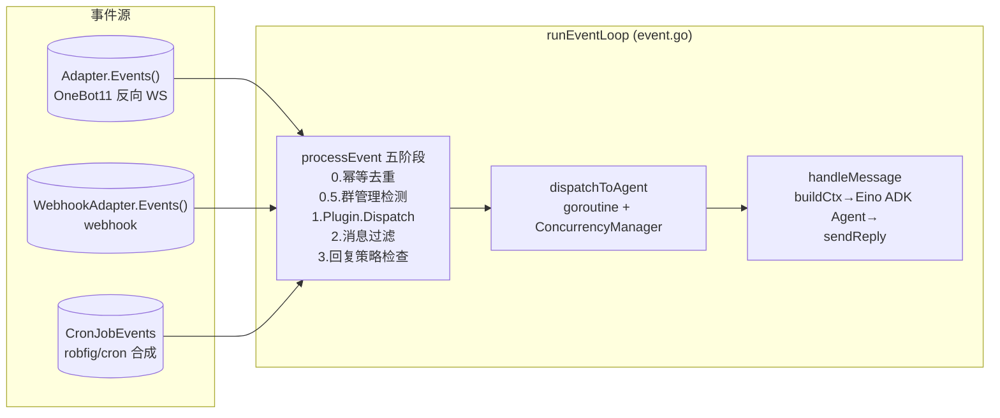

- **`EinoAgent`**（`adk.ChatModelAgent`）：基于 Eino ADK 框架的 ChatModelAgent，工具调用在 ReAct 循环内同步执行，MaxIterations=20。
- **`ConcurrencyManager`**（`concurrency.go`）：每 ChatArea 并发控制（默认 8 goroutine），使用 buffered channel 作为信号量，超限消息排队等待。
- **`CronJobManager`**（`cronjob/cronjob.go`）：`robfig/cron` 调度（秒级），命中后构造合成事件。
- **事件循环 4 个 select 分支**：`ctx.Done` / `Adapter.Events`（断流自愈）/ `webhookEvents` / `CronJobEvents`。

## Agent 子包

| 子包 | 实现 | 说明 |
|------|------|------|
| `provider` | `provider.go` | OpenAI 兼容 `/v1/chat/completions`（流式 SSE）、`Vision`（inline base64）；`ProviderGroup` 同类型单 Active 管理 |
| `mcp` | `mcp.go` | `mark3labs/mcp-go` SSE 客户端；`MCPGroup` 聚合连接 + `ListTools`/`CallTool`（MCP 可覆盖 builtin 同名工具） |
| `memory` | `memory.go` + `shortterm`/`longterm`/`skillmem` | 四层记忆：短期(Redis 滑窗, 默认100条, 自动Compact) / 长期(Postgres + 内存 LRU HotArea) / 技能记忆(SkillMemory, Compact 时 LLM 自动提取) / 会话记录(Postgres 审计) |
| `prompt` | `prompt.go` | `PromptManager` + 系统锁定提示词 `EnsureSystemPrompt` 幂等播种 + `BuildFullContext`（工具感知不拼入提示词，由 Eino tools 参数提供） |
| `session` | `session.go` | `SessionManager`：`GetOrCreate` / `AppendRecord`(Postgres) / `UpdateTokenUsage` |
| `skill` | `skill.go` | `SkillEngine.Match(input)` 按关键词 / 正则 / priority 匹配首个激活技能 |
| `tool` | `tool.go` / `builtin.go` | `ToolRegistry` + 内置工具 `RegisterBuiltinTools`（OneBot11 / 沙箱 / T2I / vision 等），工具注册为 Eino ADK ToolNode |
| `cronjob` | `manager.go` | `robfig/cron` 调度 + 合成事件 |

## 插件 API 分组（速查）

| 权限 | 全局表 / SDK 字段 | 函数 | 说明 |
|------|--------|--------|------|
| 始终 | `log` (`jn.log`) | 3 | info/warn/error → slog |
| 始终 | `json` (`jn.json`) | 2 | encode/decode |
| `onebot11` | `onebot11` (`jn.onebot11`) | 23 | 消息发送（异步/同步）+ 群管理 + 信息查询 + 请求处理 + 登录/状态/版本 + read_file_base64 |
| `http` | `http` (`jn.http`) | 4 | get/post（30s 超时）+ get_async/post_async（异步回调 `on_http_response`） |
| `database` | `database` (`jn.database`) | 2 | query/exec（共享 DB，前缀桩未生效，⚠ 权限敏感） |
| `cache` | `cache` (`jn.cache`) | 4 | get/set/del/exists（`pluggin:<name>:` 命名空间） |
| `t2i` | `t2i` (`jn.t2i`) | 7 | generate/generate_url + generate_async/generate_url_async（异步回调 `on_t2i_response`）+ toggle/is_active/get_config |
| `sandbox` | `sandbox` (`jn.sandbox`) | 11 | create/exec_shell/exec_python + create_async/exec_shell_async/exec_python_async（异步回调 `on_sandbox_response`）+ toggle/is_active/get_config/list/delete |
| `agent` | `agent` (`jn.agent`) | 17 | 配置查询 + Provider/MCP/Tool 切换 + switch_provider + compact_memory + get_current_chat_area |
| 内置 | `jn.command` | 1 | `register(path, handler, opts)` 多级命令注册 |

详见 [插件开发指南](../plugins/quickstart.md)。

## 前端 SPA 静态服务

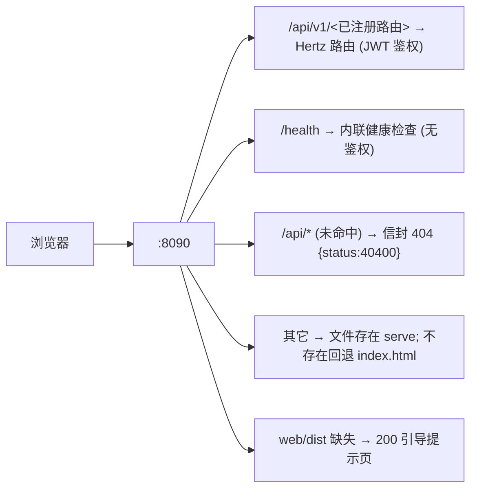

实现：`internal/web/web.go::SPAHandler`（`filepath.Rel` 路径穿越防护）；在 `internal/api/engine/engine.go` 通过 `h.NoRoute(...)` 注册。**不嵌入二进制**（`web/dist` 是磁盘文件，便于只换前端不重编 Go）。开发期 Vite `:3000` 代理 `/api`→`:8090`，Go fallback 不触发。

---

## 二、调用栈

> 调用栈图以 mermaid 流程图呈现（节点含文件:行号标注），支持缩放/拖动查看。

## 启动流程

```mermaid
flowchart TD
  M["main()<br/>main.go:41"] --> A["flag.Parse + loadDevConfig(dev.yaml)<br/>main.go:49-52 ← 开发配置加载"]
  M --> B["logging.Init(Config{Debug,Output,Hub})<br/>main.go:63 ← 彩色日志初始化"]
  M --> C["slog.SetDefault(slog.New(Handler))<br/>main.go:75 ← slog 桥接"]
  M --> D["postgres.NewPostgresClient(WithHost...)<br/>main.go:98"]
  M --> E["redis.NewRedisSentinelClient(WithAddr...)<br/>main.go:111 (实为单节点)"]
  M --> F["core.Init(ctx, db, redis)<br/>main.go:122"]
  F --> F1["AutoMigrate(db)<br/>core.go:23 ← 31 张表"]
  F --> F2["cache.NewCache(redisClient, $REDIS_PREFIX)<br/>core.go:97 ← juan: 前缀"]
  F --> F3["dao.NewBundle(db)<br/>core.go:105 ← 28 个 DAO"]
  F --> F4["acl.NewACL(bundle.ACL)<br/>core.go:110"]
  F --> F5["InitAdminUser(ctx, UserDAO)<br/>core.go:113 ← admin/Admin123 bcrypt"]
  M --> G["middleware.JWTSecret = []byte($JWT_SECRET)<br/>main.go:129-131"]
  M --> H["loadAdapterConfig(ctx, DAO)<br/>main.go:133 ← DB 加载, 回退 env"]
  M --> I["adapter.New(cfg) + Start(ctx)<br/>main.go:134-142"]
  M --> J["loadWebhookConfig / NewWebhookAdapter / Start<br/>main.go:146-162"]
  M --> K["agent.NewHagoCenter() / Init / Start<br/>main.go:166-185 ← 含 Eino ADK buildEinoAgent"]
  M --> L["pluggin.NewPluginEngine(data/pluggins, ...)<br/>main.go:189"]
  L --> L1["pluginEngine.LoadAll()<br/>main.go:199 ← ensureEmbeddedAssets + 逐目录 Load"]
  M --> N["service.New(...) 注入 ProviderGroup/MCP/...<br/>main.go:216-230"]
  M --> O["loadT2IFromDB / loadSandboxFromDB<br/>main.go:226-227 ← DB 配置 → NewClient"]
  M --> P["svc.OnUpdateT2I/OnUpdateSandbox 回调<br/>main.go:228-229 ← 热注入 HagoCenter/Service"]
  M --> Q["web.EnsureDir($WEB_DIR)<br/>main.go:237"]
  M --> R["engine.New(addr, webDir, svc)<br/>main.go:241 ← h.NoRoute=SPAHandler"]
  M --> S["go webEngine.Run() / wait ctx<br/>main.go:248-263"]
```

## 优雅退出（`cmd/server/main.go:287 shutdown`）

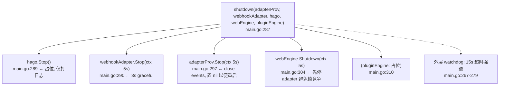

## OneBot11 反向 WS 事件接收到解析

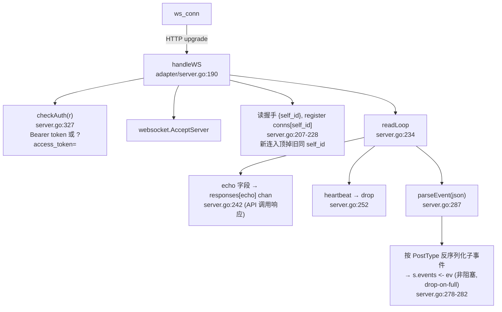

触发链路：`Adapter.events` ← `wsServer.events` ← `readLoop`。事件入口 `Adapter.Events()` (`adapter.go:124`)。

## OneBot11 API 调用（Agent 工具 / 插件 → WS）

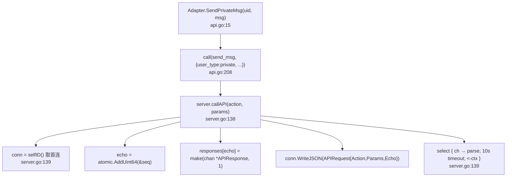

`normalizeMessage`（`api.go:324`）兼容 string / `Segment` / `[]Segment` / `*MessageBuilder`，含 CQ 码时重新解析。

## Agent 事件循环（核心路径）

```
runEventLoop                                     agent/event.go:39
└─ select {
   case <-ctx.Done(): stop
   case ev := <-h.Adapter.Events():              event.go:50
       若 channel 关闭(适配器重启): sleep 1s 重新取 Events() (event.go:52)
       ev.Admins = h.Adapter.Admins()
       h.processEvent(ctx, ev)
   case ev := <-webhookEvents:                   event.go:63 (WebhookAdapter != nil 时)
       h.processEvent(ctx, ev)
   case ev := <-h.CronJobEvents:                  event.go:69
       ev.Admins = h.Adapter.Admins()
       h.processEvent(ctx, ev)
   }
```

### processEvent（五阶段架构）

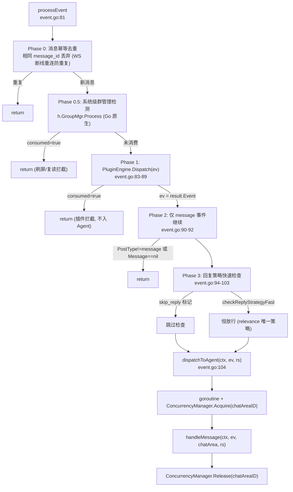

### handleMessage（Eino ADK 对话主流程）

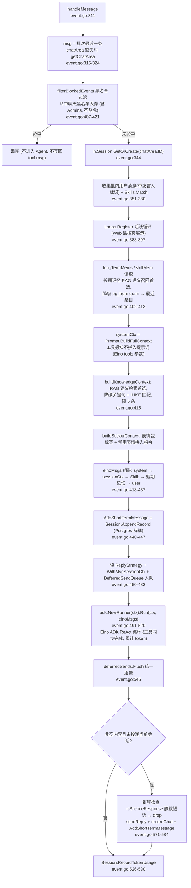

### 工具调用（Eino ADK ReAct 循环内同步执行）

工具调用完全由 Eino ADK ChatModelAgent 的 ReAct 循环管理，所有工具同步执行：

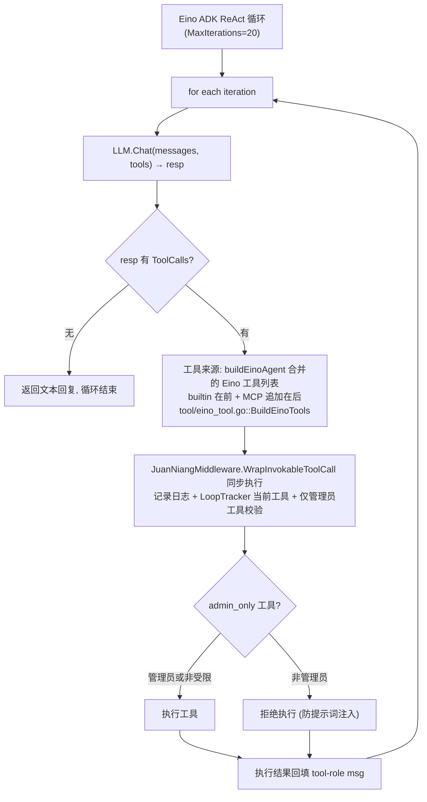

> **已移除**：BgTaskExecutor 和 DrainerAgent 已完全移除。所有工具调用（包括长时间运行的操作）均在 Eino ADK 的 ReAct 循环内同步完成。

## CronJob 调度

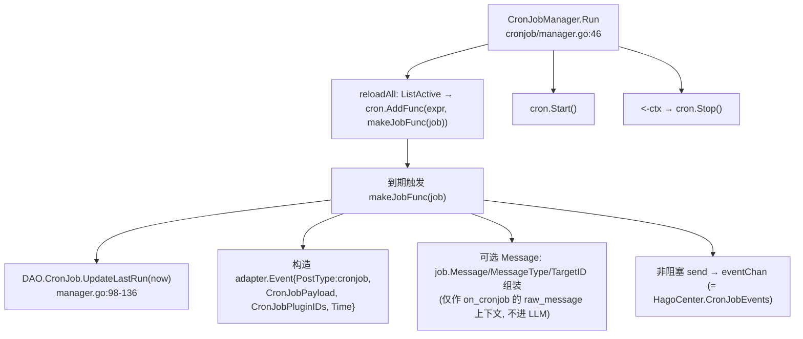

## Web API 请求 → handler

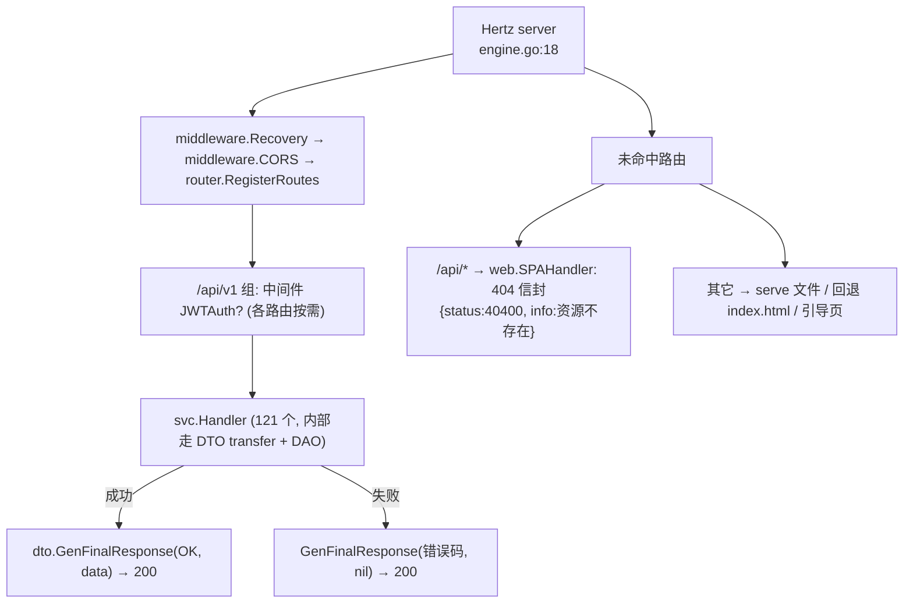

## 日志系统（自定义彩色日志）

基于 `github.com/fatih/color` 的自定义日志系统，替代 `log/slog`。功能：彩色输出、JSON 自动格式化、WARN+ 调用栈、模块日志器、GORM SQL 日志集成。

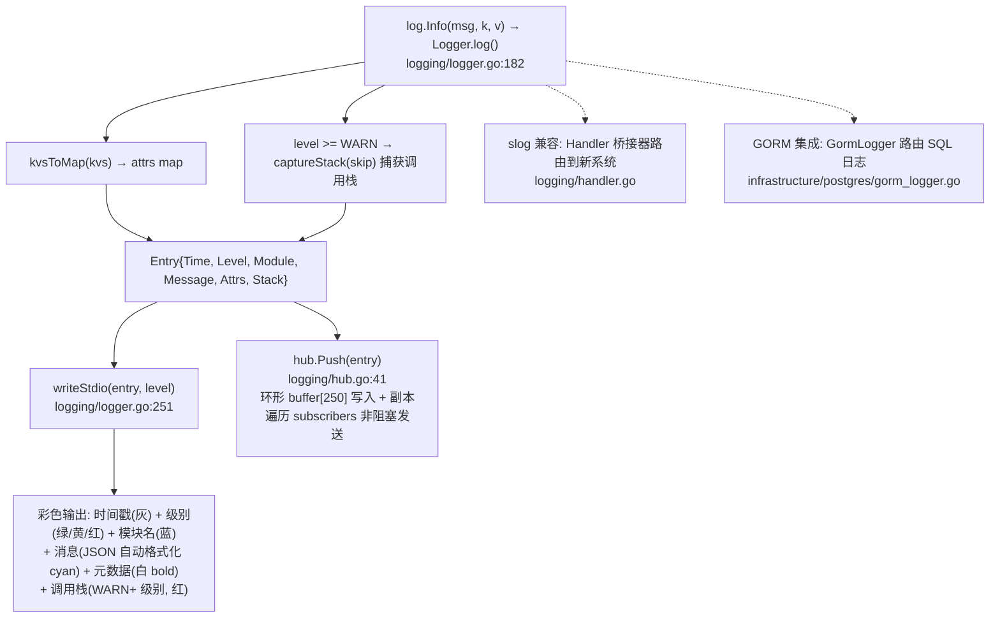

```text
GET /api/v1/logs/stream → svc.StreamLogs          service.go:1634
├─ sse.NewWriter(c)
├─ 阶段1: LogHub.Recent() 250 条按序 WriteEvent("log")
├─ 阶段2: subscribe() 实时 WriteEvent("log", entry)
└─ 每 15s WriteKeepAlive 心跳（兼测死连）
```

---

## 三、EventLoop 与事件流

## 事件来源

JuanNiang-Neo 有三类外部事件源，最终都汇入 `HagoCenter.runEventLoop`（`internal/agent/event.go:38`）：

| 来源 | 通道 | PostType | 备注 |
|------|------|----------|------|
| OneBot11 反向 WS | `h.Adapter.Events()` | `message`/`notice`/`request`/`meta_event` | 由 `internal/adapter/server.go::readLoop` 推送 |
| Webhook | `h.WebhookAdapter.Events()` (`webhookEvents`) | `webhook` | 由 `internal/adapter/webhook.go::handleRequest` 推送；外部 HTTP POST 触发 |
| CronJob | `h.CronJobEvents` | `cronjob` | 由 `agent/cronjob/manager.go::makeJobFunc` 合成 |

## EventLoop（2 个 goroutine）

`HagoCenter.Start` 启动两个并发 goroutine（`agent.go:334-339`）：

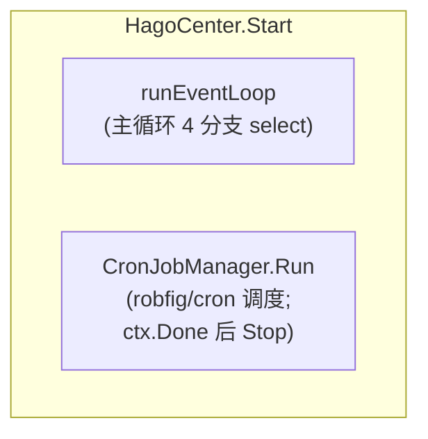

`runEventLoop` 的 4 个 select 分支（`event.go:38-77`）：

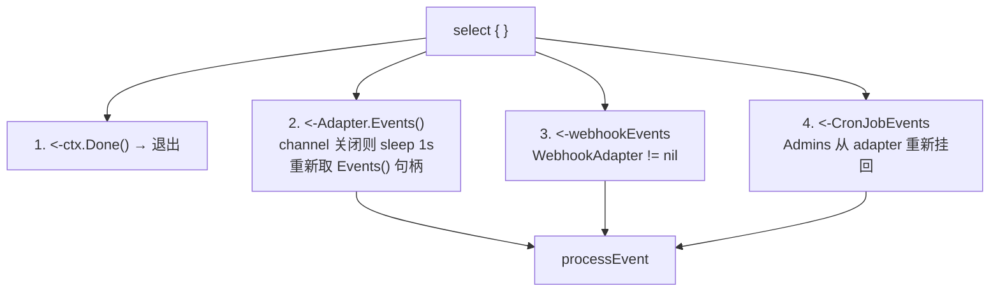

1. `<-ctx.Done()` → 直接退出循环
2. `<-h.Adapter.Events()`：OneBot11 事件。若 channel 关闭（适配器 `Stop` 调用了 `close(events)`），不会 panic——记日志、sleep 1s 重新获取 `Events()` 句柄并 continue（`event.go:52`）。这正是反向 WS 重启后事件循环自愈的关键。
3. `<-webhookEvents`（仅 `WebhookAdapter != nil`）：调用 `processEvent`。
4. `<-h.CronJobEvents`：合成 cronjob 事件，`Admins` 从 adapter 重新挂回后喂 `processEvent`。

## 事件分发决策树（processEvent 五阶段）

`processEvent`（`event.go:81-174`）采用五阶段架构：幂等去重 → 群管理检测 → Plugin 拦截 → 消息过滤 → 回复策略检查 → 异步派发 Agent。

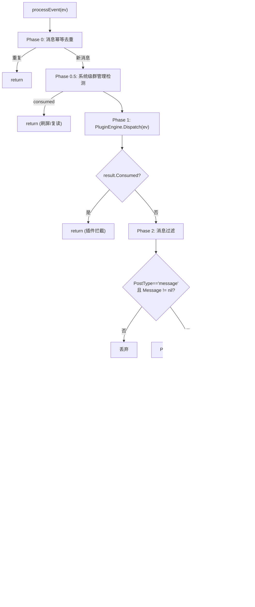

> **Phase 0（幂等去重）**：群/私聊的 `message_id` 各自独立递增，key 带 `message_type` 前缀；WS 断线重连/多连接时 OneBot 端重复推送的同一消息直接丢弃（`h.msgDedup.SeenBefore`）。
>
> **Phase 0.5（系统级群管理）**：`h.GroupMgr.Process`（Go 原生，先于所有 Lua 插件）。白名单/管理员/排除群豁免 → 违禁言论检测（RAG 黑白语录语义匹配首选：黑命中处罚 / 白命中放行，均未命中送 LLM 3s 批窗口逐条判定，RAG/LLM 均不可用降级关键词兜底）；图片刷屏 / +1 复读（跳过命令消息）`consumed=true` 拦截不进 Agent。详见下方「群管理检测闸门」章节。
>
> `checkReplyStrategyFast` 恒放行：回复策略已收敛为仅 `relevance`（@/命令/提及名字必回由规则快路径保证），LLM 相关性判断延后到 `dispatchToAgent` 的 goroutine 内由 `filterRelevant` 执行（`filterRelevant` → `relevanceBatchEvaluate`）：@/命令/提及名字 → 必回（0 次 LLM）；噪音消息（纯表情/过短/仅 URL）→ 规则丢弃；其余候选合并为**一次** LLM 批量判断（含图消息标注 `[图片]`，单条候选走原分数判断）。判断结果写 Redis（related=15s 对话轮次放宽 / unrelated=30s 冷却），判断并发全局上限 4、超时可配置（relevance_timeout，默认 10s），失败按 `judge_fail_policy`（drop/reply）降级；群聊刷屏（1s≥5 条）时批窗口拉长到 3s 并降级为只回必回消息。

## 一条消息的全程（OneBot11 → 回执）

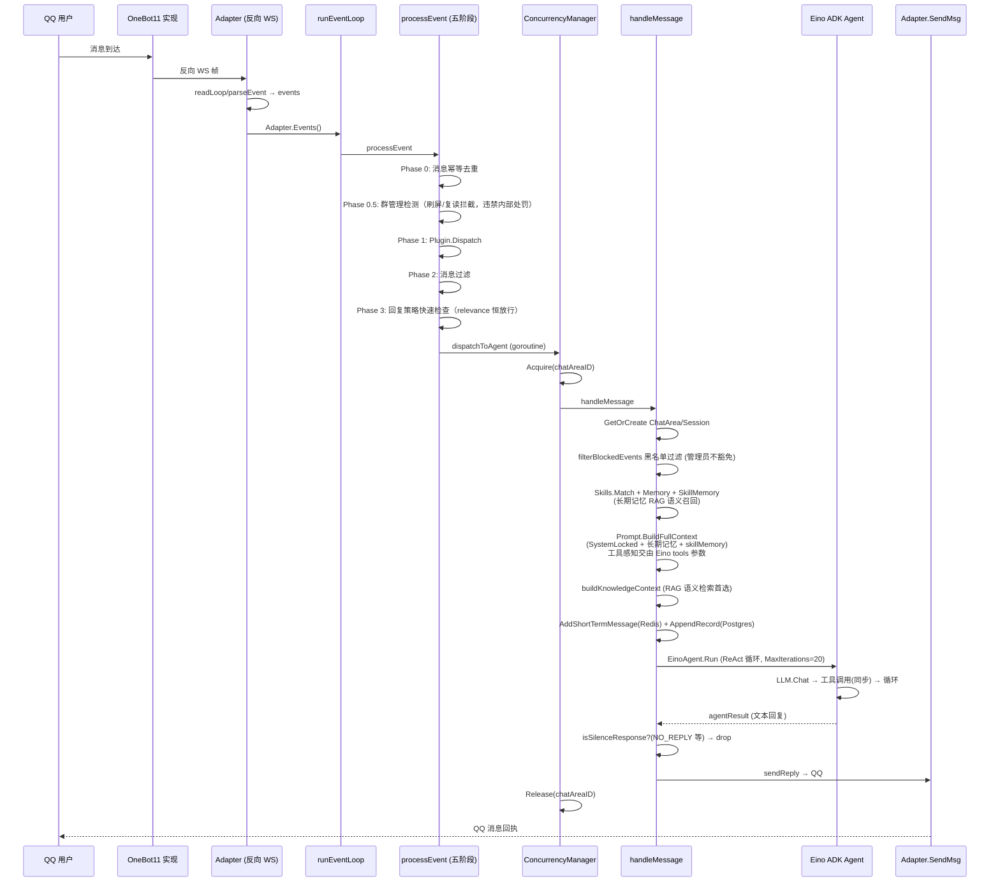

## 群管理检测闸门（Phase 0.5，系统级）

`internal/agent/groupmgr` 是与定时任务/摸鱼人日历同级的系统功能，替代旧 Lua 插件 `redrock_group_manager`。检测闸门位于 Phase 0（幂等去重）之后、Phase 1（Lua 插件派发）之前，**系统级优先于所有插件**，避免与插件双重检测/重复处罚。

```mermaid
flowchart TD
  MSG["群聊消息"] --> EX["豁免检查: 白名单 / 管理员 / 排除群"]
  EX -->|豁免| RET["放行（不进检测）"]
  EX --> CARD["推荐卡片文本化（不再直罚）"]
  CARD --> RAG["RAG 黑白语录语义匹配（第一核实人）"]
  RAG -->|黑名单命中 score ≥ black_min_score| PUNISH["直接处罚"]
  RAG -->|白名单命中 score ≥ white_min_score| PASS["放行"]
  RAG -->|均未达阈值 或 无语录命中| LLM["LLM 批量判定（3s 批窗口, 逐条独立）"]
  RAG -.RAG 不可用.| KW["降级关键词路径（= 旧插件行为）"]
  LLM -->|black| PUNISH
  LLM -->|white| PASS
  LLM -->|none| PASS2["放行"]
  LLM -->|请求失败/裁决非法| FC["fail-closed：硬信号直罚, 否则放行"]
  PUNISH --> LEARN["学习闭环: 送审原文异步入库 + RAG Upsert（越用越准）"]
  PASS --> LEARN2["学习闭环: 白名单语录异步入库"]
```

- 三级惩罚：撤回+警告 → 禁言（二次违规 30min）→ 踢出（失败保留并通知管理员）；刷屏警告/复读触发发送配图话术（`//go:embed` 内嵌）；复读检测**跳过命令消息**（`/` 前缀）
- 图片刷屏（窗口/阈值/禁言时长）、+1 复读（开关/人数）、RAG 黑白阈值（`black_min_score`/`white_min_score`）、LLM 批窗口（`llm_batch_window`，默认 3s）、排除群/白名单/统一提示词（`llm_prompt`）全部**面板可配置**（`group_mgr_configs` 单行表，保存后热重载）
- RAG 判定**不再要求硬信号**：黑白语录双集合各自独立，黑命中处罚、白命中放行；RAG 服务可用但无语录命中（含知识/记忆向量干扰的命中）一律**送 LLM 判定**，不再误判为“RAG 不可用”降级关键词
- 学习闭环：LLM 判 black → 黑名单语录（Postgres + RAG 双写），判 white → 白名单语录；异步 goroutine 串行写入（`learnMu`），幂等去重 + 每集合 2000 条上限；RAG 未配置静默跳过（`rag_synced` 仅真实写入成功才置 true）
- 系统命令：`/groupstats`、`/白名单`、`/豁免`、`/解除豁免`、`/取消豁免`（后注册覆盖插件同名命令，仅管理员）；**/豁免 按群清除违规记录**（不清其他群的三级惩罚阶梯），白名单为全局豁免
- Web API：`/group-mgr/*`（config/phrases/samples/violations/whitelist/admins/stats/test），详见 [Web API：功能模块](api/features.md)
- **GC 功能**：长期记忆 GC（默认 7 天，`LongTermMemory.GCIntervalDays` 面板可配）清理最近周期未召回的 5 条（PG + RAG 双删）；白名单语录 GC（默认 7 天，`white_gc_interval_days` 面板可配）清理未命中的 5 条（PG + RAG 双删）
- 健壮性：LLM 批量判定提示词带 `<USER_TEXT>` 定界符与指令忽略声明（防注入），输出格式契约由代码内提示词固定（不依赖外部 `LLMPrompt` 是否被改）；LLM 请求失败/裁决非法时 fail-closed（有硬信号直罚，否则放行）；违规计数/统计为数据库级原子自增（并发不丢）；群成员管理员判断走 Adapter 带缓存查询（正 10min / 负 60s）；词条软删后重建同名由部分唯一索引 + 软删行复活保障

## CronJob 注入流

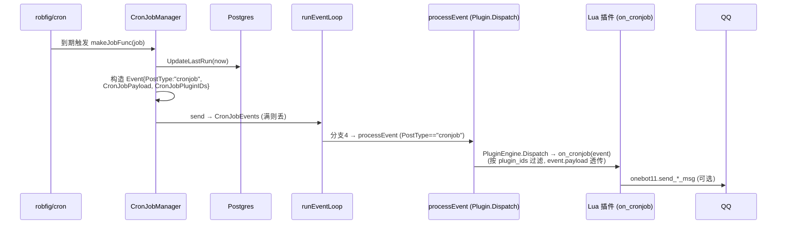

> CronJob 事件只派发给 Lua 插件（`on_cronjob` 回调），**不进入 LLM Agent**、不经过回复策略与 ACL。CronJob 的 `message`/`message_type`/`target_id` 字段仅作为 `event.raw_message` 等上下文透传给插件。

API 侧增删改后 `Manager.Reload()` 同步调度器（`service.go:1733/1768/1808/1822`），无需重启进程。详见 [webhook-cronjob.md](webhook-cronjob.md)。

## Webhook 注入流

```mermaid
sequenceDiagram
  participant Ext as 外部服务
  participant WH as WebhookAdapter
  participant EL as runEventLoop
  participant Plugin as Lua 插件 (webhook 权限)
  participant QQ as QQ

  Ext->>WH: HTTP POST (Bearer token)
  WH->>WH: checkWebhookAuth / body 解析<br/>(JSON 失败则包装 raw)
  WH->>WH: 构造 Event{PostType:"webhook", Webhook:{Path,Method,Payload}}
  WH->>WH: 非阻塞 send → events (满则 503)
  WH-->>Ext: 200 / 503
  EL->>EL: 分支3 (webhookEvents) → processEvent
  EL->>Plugin: PostType=="webhook" → OnWebhook (仅插件，不调 LLM)
  Plugin->>QQ: onebot11.send_*_msg
```

> Webhook 不走 Agent LLM 路径，是对外暴露给 Lua 插件的事件钩子（如 GitHub push 通知触发群发）。详见 [webhook-cronjob.md](webhook-cronjob.md)。

## 关键不变量

- **Adapter 重启不会击穿事件循环**：`Adapter.Stop` 会 `close(events)` 并置 nil，`Start` 时若 `events==nil` 重建（`adapter.go:36-62`）；EventLoop 分支2 检测关闭后 sleep 1s 重新取句柄（`event.go:52`）。
- **Redis 与 Postgres 解耦**：短期记忆写 Redis 是为了 LLM 上下文窗口，`Session.AppendRecord` 写 Postgres 是为了审计检索；任一失败不影响另一路。
- **Admins 绕过 ACL**：Admins 列表（来自 `Onebot11Adapter.AdminQQNumbers`）从 adapter 透传到每条 `Event`；`handleMessage` 中 `isAdmin(userID, admins) || ACL.CheckChat(...)` 决定消息是否进入 Agent。ACL 现仅管理聊天黑名单（仅 `deny` 规则生效，`allow` 规则不再生效）。
- **`__NO_REPLY__` 静默**：LLM 可主动输出 `__NO_REPLY__` 让系统不发任何 QQ 消息（避免群聊噪音）。
- **SystemLocked 强制拼接**：每次对话系统提示词必含 `__system_locked__` 内容，前端不能停用，保证 LLM 知道能用 T2I 富文本、分消息段、权限层级等行为约束。
- **工具调用全同步**：所有工具调用（包括长时间运行的操作）均在 Eino ADK ReAct 循环内同步完成，无后台任务分流。BgTaskExecutor 和 DrainerAgent 已完全移除。
- **每 ChatArea 并发控制**：`ConcurrencyManager` 通过 buffered channel 信号量控制每个 ChatArea 最多 8 个 Agent goroutine 并发（默认值可配置），超限消息排队等待。

---

## 四、插件系统

## 概述

JuanNiang-Neo 的 Lua 插件系统基于 `gopher-lua`（Go-Lua 绑定），允许用户通过 Lua 脚本扩展机器人功能。插件可以：

- 拦截 OneBot11 消息事件 / Webhook 事件
- 注册多级斜杠命令（如 `/system provider switch`）
- 调用 OneBot11 协议接口、HTTP、数据库、Redis 缓存、T2I、Sandbox、Agent 操作接口
- 通过内嵌 Lua SDK（`jn.lua`，带 LuaCATS 注解）获得 IDE 类型提示

> **拼写约定**：`pluggin`（双 g 单 n）是**有意**拼写：模块路径 `internal/pluggin`、配置文件 `pluggin.yaml`、插件目录 `data/pluggins`。请勿"修正"为 `plugin`。开发完整指南见 [插件开发指南](../plugins/quickstart.md)。

## 组件结构

```mermaid
flowchart TB
  subgraph PE["internal/pluggin/"]
    PG["pluggin.go<br/>PluginEngine 核心 (1579 行):<br/>生命周期 / injectBaseAPI / 事件分发"]
    AD["adapter.go<br/>AdapterWrapper<br/>(桥接 *_adapter.Adapter)"]
    CMD["command.go<br/>CommandRegistry<br/>+ CommandNode 命令树"]
    SDK["sdk/jn.lua<br/>内嵌 //go:embed<br/>启动落盘到 data/pluggins/sdk/jn.lua"]
    SYSP["systemplugin/<br/>pluggin.yaml + main.lua<br/>(system: true 系统插件)"]
  end
  PG --> AD
  PG --> CMD
  PG --> SDK
  PG --> SYSP
```

## 生命周期

```mermaid
stateDiagram-v2
  [*] --> Unloaded
  Unloaded --> Loading: LoadAll (启动)
  Loading --> ManifestCheck: 读 pluggin.yaml
  ManifestCheck --> Skipped: 非系统插件且 enabled=false
  ManifestCheck --> Loading: 启用 / 系统
  Loading --> Injecting: NewState + injectSDK + injectBaseAPI(按权限)
  Injecting --> DoFile: L.DoFile(entry)
  DoFile --> Loaded: 存 LoadedPlugin
  Loaded --> Unloaded: Unload (系统拒绝)
  Loaded --> Loading: Reload (Unload+Load)
  Loaded --> EnabledOff: SetEnabled(false) 改 yaml
  EnabledOff --> Loading: SetEnabled(true)
  Skipped --> [*]
```

代码位置：

```mermaid
flowchart TD
  LA["LoadAll (启动调用)<br/>pluggin.go:207"] --> EA["ensureEmbeddedAssets: 写 sdk/jn.lua + system/{pluggin.yaml,main.lua}<br/>每次 startup 强制覆盖<br/>pluggin.go:1554"]
  EA --> RD["读 basePath (默认 data/pluggins) 目录"]
  RD --> SK["跳过 sdk/ 子目录"]
  SK --> IT["逐插件目录: 读取 manifest"]
  IT --> EN{"非系统插件且 Enabled==false?"}
  EN -->|是| SKIP["跳过 (不加载)"]
  EN -->|否| LD["Load(name)<br/>pluggin.go:239"]
  LD --> L1["mutex 持锁; 拒绝重复加载"]
  L1 --> L2["读 manifest (pluggin.yaml)"]
  L2 --> L3["PPID 为空 → 生成 UUID 并写回<br/>pluggin.go:254"]
  L3 --> L4["lua.NewState"]
  L4 --> L5["injectSDK: sdk/?.lua 追加 package.path<br/>(require jn 可用)"]
  L5 --> L6["injectBaseAPI: 按 permissions 注入全局表"]
  L6 --> L7["injectCommandAPI: 注入 register_command"]
  L7 --> L8["L.DoFile(entry; 默认 main.lua) → run"]
  L8 --> L9["存 LoadedPlugin"]
  LD -.->|失败| ERR["仅 slog.Error, 不阻塞其他插件"]
  L9 --> UN["Unload(name)<br/>pluggin.go:281"]
  UN --> U1["系统插件拒绝 (返回 err)"]
  UN --> U2["commands.UnregisterPlugin(name) 清理命令"]
  UN --> U3["LState.Close()"]
  L9 -.-> RL["Reload(name) = Unload + Load<br/>pluggin.go:301"]
  L9 -.-> SE["SetEnabled(name, bool) 重写 pluggin.yaml enabled<br/>pluggin.go:1439"]
  L9 -.-> LS["List() / ListMaps()<br/>pluggin.go:308/321"]
```

系统插件三层守卫（`Manifest.System` + `PluginEngine.IsSystem()` + Service 层 Toggle/Delete），确保 `system` 插件不可删/停。

## Manifest（`pluggin.yaml`）

| 字段 | 类型 | 说明 |
|------|------|------|
| `ppid` | string | 稳定 UUID（空时自动生成并写回） |
| `name` | string | 插件名（=目录名，作为 `id`） |
| `version` | string | 版本，默认 `"1.0.0"` |
| `author` | string | 作者 |
| `description` | string | 描述 |
| `entry` | string | Lua 入口，默认 `main.lua` |
| `permissions` | string[] | 申请的权限（`onebot11`/`http`/`database`/`cache`/`t2i`/`sandbox`/`agent`） |
| `system` | bool | 系统插件（undeletable / unstoppable） |
| `enabled` | bool | 是否启用（控制是否在 LoadAll 时加载） |

示例（系统插件 `internal/pluggin/systemplugin/pluggin.yaml`）：

```yaml
ppid: 6563c9c3-1072-4168-8bb3-62db4c11990b
name: system
version: "1.0.0"
author: JuanNiang-Neo
description: "系统插件，封装 Agent/Provider/MCP/Tool/T2I/Sandbox/Session 管理命令"
entry: main.lua
system: true
enabled: true
permissions:
  - onebot11
  - agent
  - t2i
  - sandbox
```

## 事件回调

插件通过两个全局 Lua 函数拦截事件（PCall，2 返回值 `(consumed bool, reply string)`）：

| 回调 | 触发 | 权限过滤 |
|------|------|----------|
| `on_message(event)` | 收到 OneBot11 `/` 开头走 commands.Dispatch；否则对每条有 `onebot11` 权限的插件调用 | `onebot11` |
| `on_webhook(event)` | Webhook 事件到达（不走 LLM Agent） | `webhook` |

`EventData` 结构（传给 Lua 的 event table）：

```go
type EventData struct {
    PostType    string
    MessageType string
    UserID      int64
    GroupID     int64
    RawMessage  string
    Admins      []string
    Webhook     map[string]any
}
```

`OnMessage` 决策（`pluggin.go:397-441`）：

```mermaid
flowchart TD
  OM["OnMessage(event)"] --> Store["存 currentEv"]
  Store --> Q{"RawMessage 以 '/' 开头?"}
  Q -->|是| Cmd["commands.Dispatch<br/>命中 → sendReply + return consumed=true"]
  Q -->|否| Iter["遍历 plugins 有 'onebot11' 权限"]
  Iter --> Each["plugin.on_message(event) → (consumed, reply)"]
  Each --> C{"consumed=true?"}
  C -->|是| Send1["sendReply + 短路<br/>(不再调后续插件/Agent)"]
  C -->|否| Reply{"reply 非 nil?"}
  Reply -->|是| Send2["sendReply"]
  Reply -->|否| Next["继续下一个插件"]
```

## 命令树（CommandRegistry）

`internal/pluggin/command.go` 实现多级命令派发：

```mermaid
flowchart TB
  Root["Root CommandNode"]
  Root --> N1["Name='weather', Opts{Description}"]
  N1 --> N2["Name='today', Handler=fn, Opts{...}"]
  N2 --> Leaf1["leaf: /weather today"]
  Root --> N3["Name='system', Opts{...}"]
  N3 --> N4["Name='provider', Opts{...}"]
  N4 --> N5["Name='list', Handler=fn"]
  N4 --> N6["Name='switch', Handler=fn"]
  Root --> N7["Name='help', Handler=fn"]
```

```
CommandNode {Name, Opts{Description,Usage}, Handler, PluginName, Children map}
   长前缀匹配, 最长匹配节点带 Handler 时执行
   未命中 Handler 但停在非 root → 返回该节点子命令列表
   Dispatch(raw, event): 按 "/" 分词遍历, 取最后带 handler 的节点, 调用 handler(剩余 args, event)
```

命令 handler 签名（Go 侧）：

```go
type CommandHandler = func(args []string, event EventData) (consumed bool, reply string, err error)
```

Lua 侧通过 SDK `jn.command.register(path, handlerFn, opts)` 注册，path 可为 string 或 table（多级），handler 接收 `(argsTable, eventTable)` 返回 `(consumedBool, replyString)`。

内置 `/help` 在 `registerBuiltinCommands()` 注册（plugin=`system`），列出所有顶级命令；`/help <cmd> [sub...]` 列出子命令与用法。

插件卸载时 `UnregisterPlugin(name)` 递归清理该插件注册的所有命令并修剪空叶子。

## 注入的 Lua 全局表

按 `permissions` 字段 gated，由 `injectBaseAPI`（`pluggin.go:973`）注入。完整签名见 [插件开发指南](../plugins/api-reference.md)。

| 全局表 | 权限 | 说明 |
|--------|------|------|
| `log` | 始终 | info/warn/error → slog `[plugin:<name>]` 前缀 |
| `json` | 始终 | encode/decode |
| `onebot11` | `onebot11` | OneBot11 API（发送/群管理/请求处理/合并转发/引用回复等） |
| `http` | `http` | get/post + 异步，30s 超时真实 HTTP（可选 http/socks4/socks5 代理） |
| `database` | `database` | query/exec（共享 DB；`prefixSQL` 桩未生效，⚠ 任意 SQL） |
| `cache` | `cache` | get/set/del/exists（`pluggin:<name>:` 前缀命名空间） |
| `t2i` | `t2i` | generate / generate_url + toggle/is_active/get_config |
| `sandbox` | `sandbox` | create/exec_shell/exec_python/list/delete + toggle/is_active/get_config |
| `rag` | `rag` | add/add_async/search/search_async（对接 RAG-Service） |
| `agent` | `agent` | 配置查询 + Provider/MCP/Tool 切换 + switch_provider + compact_memory |
| `jn.command` | 内置 | 命令注册 |

## Lua SDK（`jn.lua`）

由 Go 二进制内嵌（`//go:embed sdk/jn.lua`，`pluggin.go:1543`），启动时 `ensureEmbeddedAssets` 落盘到 `data/pluggins/sdk/jn.lua`（每次覆盖以匹配二进制版本）。`injectSDK` 把 `<basePath>/sdk/?.lua` 追加到 LState 的 `package.path`，使 `require("jn")` 可用。

SDK 仅捕获 Go 注入的全局表作为模块字段（`jn.log = log` 等），不引入额外行为；带 LuaCATS 注解，sumneko lua-language-server 可提供完整代码提示。

```lua
local jn = require("jn")
jn.log.info("插件启动")
local id, err = jn.t2i.generate("<h1>Hello</h1>")
```

## 数据隔离

- **Cache**：所有 `cache.*` 操作自动加 `pluggin:<name>:` 前缀，插件间键不冲突，且无法读写 Agent 的 `session:`/`shortterm:` 前缀。
- **Database**：`database.query/exec` 跑在**共享库**上，`prefixSQL` 桩当前未应用 `pluggin_<name>_` 前缀；请谨慎授 `database` 权限（⚠ 任意 SQL，可在插件侧加自己的表前缀）。
- **插件配置**：`data/pluggins/<name>/pluggin.yaml` 在磁盘，不进 DB（除非 DB `plugins` 表存元数据镜像）。

## 安全建议

- 仅对受信插件授予 `database` 权限
- 对从社区上传的 ZIP 插件先审阅 Lua 源码再 Deploy
- 系统插件 `system` 提供 `/system provider switch`、`/system memory compact` 等管理命令，需要 admin 操作（受 ACL 与 OneBot11 Adapters 的 Admins 双重保护）
